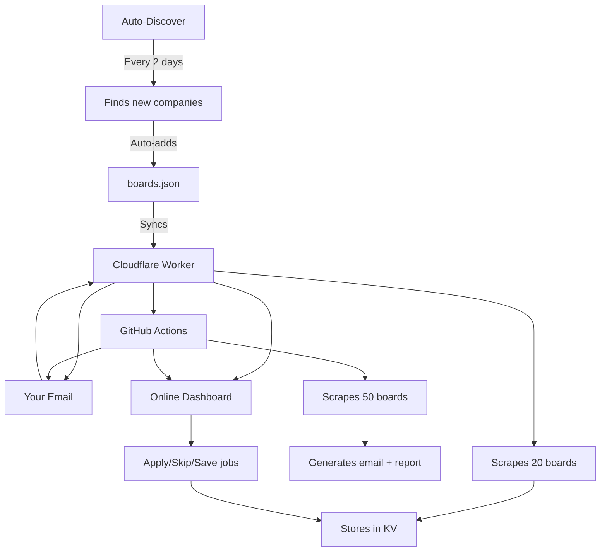

# Job Agent — Automated Cloud Engineering Job Search

An automated job search agent that scrapes 50+ engineering career pages, ranks positions against your profile using a multi-signal scoring engine, and delivers daily email digests. Runs on Cloudflare (always-on dashboard) and GitHub Actions (daily email automation) — no manual effort required.

**Target roles:** GCP / Cloud / Platform / SRE engineers, remote-first, India-focused.

---

## What It Does

1. **Scrapes 50+ free company career APIs** — Direct access to Greenhouse boards (Cloudflare, Stripe, Databricks, SpaceX, etc.) with zero paywalls
2. **Ranks jobs intelligently** — Multi-signal scoring: title match, skills overlap, remote/hybrid fit, salary, recency, deal-breaker filtering (sales/PE roles blocked)
3. **Always-online dashboard** — Accessible from any device at https://job-agent-web.clinton-s-almeida.workers.dev with filters, scores, one-click apply prep
4. **Daily email digest** — Automatically emailed every morning at 8:00 AM IST via GitHub Actions, even when your computer is off
5. **Persistent tracking** — Jobs, applications, and scrape history stored in Cloudflare KV; survives across runs and devices
6. **Auto-discovery** — Automatically finds new companies using Greenhouse every 2 days
7. **Rate limiting** — Configurable limits prevent exponential job growth (15 jobs/board, 3000 total)

---

## How It Works



**Why two systems?**

- The Cloudflare Worker keeps the dashboard live 24/7 with fast updates (20 boards due to CPU limits)
- GitHub Actions runs the deeper, full scrape (50 boards) and handles email delivery
- They're independent — one failing doesn't break the other
- Auto-discovery finds new Greenhouse companies automatically every 2 days

---

## Online Dashboard

**URL:** https://job-agent-web.clinton-s-almeida.workers.dev

Open it on any phone, tablet, or computer. Features:

- **Job list** — All matched positions sorted by relevance score
- **Apply** — Mark a job as applied; it stays marked across all future scrapes
- **Skip** — Mark as not interested; filtered from the default view
- **Save** — Bookmark a job for later
- **Scrape Now** — Trigger an immediate fresh scrape from the dashboard
- **Filters** — View by status (new / applied / skipped / saved) and by source
- **Stats panel** — See total jobs, new jobs, applied count, last run time

All actions are saved in the cloud. Switch devices and your history follows you.

---

## Project Structure

```
job-agent-web/
├── worker.js              # Cloudflare Worker — serves dashboard + handles scrapes
├── server.js              # Local Express server (optional, for local dev)
├── main.js                # CLI entry point — run locally with node main.js --no-ai
├── wrangler.toml          # Cloudflare Worker config (KV namespace IDs, schedule)
├── .env                   # Your API keys (never committed to git)
├── src/
│   ├── scraper.js         # Fetches jobs from Greenhouse, LinkedIn RSS, etc.
│   ├── matcher.js         # Scores each job against your profile (0–120+ pts)
│   ├── runner.js          # Pipeline: scrape → rank → save → email
│   ├── discover.js        # Auto-discovers new Greenhouse companies
│   ├── email.js           # Sends daily digest via Resend API
│   ├── reporter.js        # Generates the HTML report attached to emails
│   ├── onboarding.js      # Interactive setup wizard (first-time users)
│   ├── db.js              # Local data persistence (SQLite / JSON fallback)
│   └── tracker.js         # Tracks which jobs you've applied to or skipped
├── public/
│   ├── index.html         # Dashboard HTML page
│   ├── app.js             # Dashboard interactivity
│   └── styles.css         # Dashboard styling
├── data/
│   ├── boards.json        # Job board list + rate limits (auto-updated)
│   ├── board_sources.json # Configuration for board discovery sources
│   ├── discovery_results.json # Latest discovery run results
│   └── jobs.db.json       # Local persistent job database
└── .github/workflows/
    ├── daily-jobs.yml     # GitHub Actions cron — runs every day at 8:00 AM IST
    ├── auto-update-boards.yml  # Syncs boards.json to Worker every 2 days
    └── auto-discover-boards.yml  # Discovers new companies every 2 days
```

---

## Setup (First-Time Users)

### Step 1 — Install

```bash
git clone https://github.com/clinton-almeida-s/job-agent-web.git
cd job-agent-web
npm install
```

### Step 2 — Run the Setup Wizard

```bash
node main.js --setup
```

The wizard asks for:
- Your name, email, phone, LinkedIn handle
- Your preferred work location (Mumbai / Remote / other cities)
- Your skills keywords (e.g. `GCP, Kubernetes, Terraform`)
- Target job titles (e.g. `GCP Engineer, Cloud Architect, SRE`)
- Minimum salary expectation
- Professional summary for cover letters

This saves to `data/profile.json`, which later matches jobs against your profile.

### Step 3 — Configure Email (Optional but Recommended)

Create a `.env` file in the project root:

```bash
# Email notifications (required for daily digest)
RESEND_API_KEY=your_resend_api_key
EMAIL_TO=your@email.com

# AI cover letters (optional — needs Anthropic API key)
ANTHROPIC_API_KEY=your_anthropic_key

# LinkedIn results (optional — cookies expire after a few days)
LINKEDIN_COOKIES=your_session_cookies
```

**Getting a Resend API key (free):** 
1. Sign up at https://resend.com
2. Go to API Keys → Create API Key
3. Free tier: 100 emails/day — plenty for daily job digests

### Step 4 — Run Your First Scrape

```bash
# Quick run (no AI, fastest)
node main.js --no-ai

# With AI cover letters (slower, needs ANTHROPIC_API_KEY)
node main.js

# Or launch the local dashboard
npm start
# Then open http://localhost:3000
```

---

## Daily Automation (GitHub Actions) — Recommended

This runs automatically every day. Your computer can be off.

### 1. Add GitHub Secrets

Go to your repo → Settings → Secrets and variables → Actions → New repository secret:

| Secret | Value |
|--------|-------|
| `RESEND_API_KEY` | Your Resend API key |
| `EMAIL_TO` | `your@email.com` |

Optional secrets:
| Secret | Value |
|--------|-------|
| `ANTHROPIC_API_KEY` | For AI cover letters |
| `LINKEDIN_COOKIES` | For LinkedIn results |

### 2. What Happens Each Run

1. Checks out the code
2. Installs dependencies
3. Scrapes all 50 Greenhouse boards + LinkedIn
4. Ranks jobs against your profile
5. Generates an HTML report
6. Emails you a digest with top matches + attaches the full report
7. Uploads the report as a 7-day artifact for download

### 3. Schedule

Runs every day at **8:00 AM IST** (2:30 AM UTC).

### 4. Test Manually

Go to Actions → Daily Job Agent → "Run workflow"

---

## Auto-Discovery System

The agent automatically discovers new companies using Greenhouse every 2 days.

### How It Works

1. **Scans 100+ seed companies** daily (Airbnb, Uber, Spotify, Shopify, etc.)
2. **Validates** if each company uses Greenhouse API
3. **Adds new boards** to `data/boards.json` automatically
4. **Commits changes** to git and updates the Cloudflare Worker
5. **Emails you** a list of newly discovered companies

### Discovery Schedule

| Time (IST) | Action |
|------------|--------|
| 6:30 AM | Auto-discover new companies |
| 8:00 AM | Sync boards to Worker |
| 8:00 AM | Daily job scrape + email |

### Configuration

Edit `data/boards.json` to customize:

```json
{
  "greenhouse": [...],
  "lever": [...],
  "worker_limit": 20,
  "max_jobs_per_board": 15,
  "max_total_jobs": 3000
}
```

**Rate Limits:**
- `max_jobs_per_board`: Maximum jobs fetched per company (default: 15)
- `max_total_jobs`: Hard cap on total jobs in database (default: 3000)
- `worker_limit`: Boards scraped by Worker (default: 20)

---

## Cloudflare Workers Deployment (Already Done)

The dashboard is already deployed and live. If you ever need to redeploy:

```bash
npm install -g wrangler
wrangler login

# Create KV namespace (only needed once)
wrangler kv namespace create JOBS_KV

# Set secrets (one-time)
wrangler secret put RESEND_API_KEY
wrangler secret put EMAIL_TO

# Deploy
wrangler deploy
```

Your dashboard URL: `https://job-agent-web.<your-subdomain>.workers.dev`

**Note:** The Worker only scrapes 20 boards (vs. 50 on GitHub Actions) because Cloudflare has CPU time limits. The GitHub Actions run still fetches all 50 boards with full descriptions — they complement each other.

---

## Job Sources

### Working Sources

| Source | Boards | Notes |
|--------|--------|-------|
| **Greenhouse API** | 50+ companies | Direct company career APIs, no paywall |
| **LinkedIn RSS** | Real-time | Lightweight fetch, limited results |

### Blocked / Removed Sources

| Source | Status | Reason |
|--------|--------|--------|
| Naukri / Indeed | ❌ Blocked | Anti-bot measures |
| RemoteOK / WeWorkRemotely | ❌ Removed | Now require paid subscriptions |

### Sample Greenhouse Companies

**India-friendly (with engineering roles in India):** Zscaler, GitLab, Anthropic, Okta, Databricks, Stripe, MongoDB, Twilio, Coinbase, Airbnb

**Remote-friendly:** Cloudflare, Stripe, Datadog, Databricks, MongoDB, Elastic, Okta, Figma, Vercel, Airbnb, Discord, Twitch, Reddit

**Space / Defense:** SpaceX, RocketLab, Relativity Space, BlackSky

**Recently Discovered:** Airtable, Amwell, Zocdoc, Coursera, Udemy, Duolingo, Kayak, BuzzFeed, Gemini, Zscaler, GitLab, Anthropic

---

## How Jobs Are Scored

Each job gets a score from 0 to 120+ based on these signals:

| Signal | Weight | Description |
|--------|--------|-------------|
| Title exact match | 40 pts | Matches your target titles exactly |
| Title similarity | 25 pts | Fuzzy match (e.g. "Cloud Engineer" ≈ "GCP Engineer") |
| Required skills | 15 pts | Skills listed in the job match your profile |
| Bonus skills | 5 pts | Extra technology stack matches |
| Remote | 20 pts | Confirmed remote role |
| Hybrid | 10 pts | Hybrid in your preferred location |
| Location | 15 pts | Job location within your preferences |
| Employment type | 10 pts | Full-time / permanent |
| Salary fit | 10 pts | Meets your minimum salary requirement |
| Recency | 10 pts | Posted within the last 7 days |

**Auto-filter rules:**
- Sales, marketing, HR, recruiter roles are blocked entirely
- Non-technical roles get penalized automatically
- Jobs scoring below 20 points are excluded from results

---

## API Endpoints

The Cloudflare Worker exposes these REST endpoints:

| Endpoint | Method | Description |
|----------|--------|-------------|
| `/api/stats` | GET | Get dashboard statistics |
| `/api/jobs` | GET | List jobs with filters (status, limit, source) |
| `/api/profile` | GET | Get current profile |
| `/api/profile` | POST | Update profile |
| `/api/scrape` | POST | Trigger manual scrape |
| `/api/applied` | POST | Mark job as applied |
| `/api/skip` | POST | Mark job as skipped |
| `/api/save` | POST | Save/bookmark a job |
| `/api/ignore` | POST | Ignore a job |
| `/api/config` | GET | Get boards configuration |
| `/api/config` | POST | Update boards configuration |

---

## Troubleshooting

### No jobs found

```bash
node -e "const { scrapeAllSources } = require('./src/scraper'); scrapeAllSources(['GCP']).then(j => console.log(j.length, 'jobs'))"
```

### Dashboard won't load locally

```bash
# Check what's using port 3000
netstat -ano | findstr :3000

# Kill the process
taskkill /IM node.exe /F

# Restart
npm start
```

### Not receiving emails

1. Verify `.env` has `RESEND_API_KEY=your_actual_key`
2. Check your spam folder
3. Visit https://resend.com to see delivery status

### LinkedIn returns no results

Your cookies have expired. Refresh them:

1. Open LinkedIn while logged in
2. Press F12 → Network tab → Refresh page
3. Click any `linkedin.com` request → Headers → Request Headers
4. Copy the value after `cookie:`
5. Add to `.env`: `LINKEDIN_COOKIES=your-cookie-string`

> LinkedIn cookies expire after a few days. Update periodically.

### Dashboard shows old data

Click the **"Scrape Now"** button on the dashboard, or wait for the next automatic run at 7:30 AM IST.

### Want to add more companies?

1. Edit `data/boards.json` and add to the `greenhouse` array
2. Commit and push to git
3. The auto-update workflow will sync to the Worker automatically

---

## License

ISC
